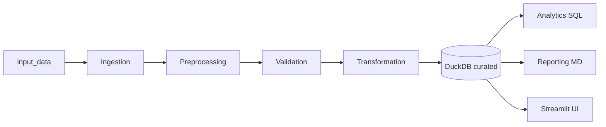

# OmniRetail Data Management Platform

A local, reproducible data-management pipeline for OmniRetail’s customer-360 and order-reconciliation initiative. Raw CSV and JSONL sources are ingested into DuckDB, validated against twelve data-quality rules, transformed into curated dimensions and facts, and exposed through analytics SQL, markdown reports, and a Streamlit dashboard.

## Quickstart

**Requirements:** Python 3.12+ and `pip`.

### One command (recommended)

From the project root:

```bash
cd Agentic_Data_Management_Take_Home_Candidate_Pack
make run
```

This installs dependencies, runs the full pipeline, and opens the Streamlit dashboard.

Without Make:

```bash
chmod +x scripts/run.sh
./scripts/run.sh
```

### Verify without UI

```bash
make all    # install + pipeline + pytest
```

### Manual steps

```bash
pip install -r requirements.txt
python -m src.pipeline          # ETL + reports
streamlit run app/Home.py       # dashboard
```

**Expected runtime:** pipeline under 5 seconds on the bundled dataset; Streamlit starts in a few seconds.

**Make targets:** `make help` lists `run`, `all`, `pipeline`, `app`, `test`, `lint`, `format`, `clean`.

**Outputs (after pipeline run):**

| Artifact | Path |
|----------|------|
| Curated database | `outputs/curated.duckdb` |
| Exception export | `outputs/exceptions.csv` |
| Data quality report | `outputs/data_quality_report.md` |
| Business answers | `outputs/business_answers.md` |

## Repository layout

```
input_data/              # Source CSVs, JSONL, DQ rules, business context
sql/
  ddl/                   # Raw and curated table DDL
  transformations/       # SQL views mirroring Python transforms
  analytics/             # Business questions Q1–Q5
src/
  config/                # Paths, schemas, geography mappings
  database/              # DuckDB connection and DDL runner
  ingestion/             # CSV/JSONL loaders
  preprocessing/         # Timestamps, geo, email, coercion, dedup
  validation/            # DQ001–DQ012 checks and exception writer
  transformation/        # dim_* / fact_* builders and persist
  analytics/             # Python wrappers for Q1–Q5 SQL
  reporting/             # Markdown report generators
  pipeline.py            # End-to-end orchestrator
app/                     # Streamlit UI (Home + three pages)
outputs/                 # DuckDB and generated artifacts
tests/                   # Unit and end-to-end tests
```

## Architecture



Layers are isolated: each module has a single responsibility and communicates through well-defined DataFrames or SQL tables.

## Business questions answered

| # | Question | Where to look |
|---|----------|----------------|
| Q1 | Completed revenue by month | Analytics → Q1; `outputs/business_answers.md` |
| Q2 | Top 10 customers by completed order value | Analytics → Q2 |
| Q3 | Orders with DQ / reconciliation exceptions | Analytics → Q3; Data Quality page |
| Q4 | Completed revenue by shipping state | Analytics → Q4 |
| Q5 | Negative tickets vs order exception rate | Analytics → Q5 |

See `outputs/business_answers.md` for live values from the latest pipeline run.

## Data quality rules

Rules are defined in `input_data/data_quality_rules.csv` (DQ001–DQ012). Exceptions are written to `dq_exception_report` in DuckDB and `outputs/exceptions.csv`. The **Data Quality** Streamlit page shows violations by rule with severity and suggested actions.

**Latest run (reference):** 17 exceptions across 12 rules; 19 `dim_customer` rows; 30 `fact_order` rows after deduplication.

## How modules are isolated

- **Config** (`src/config/`) has no pandas or duckdb imports; paths and schemas live in one place.
- **Validation** checks read a staging dict and return exception DataFrames; they do not write curated tables.
- **Transformation** builds curated frames independently; invalid foreign-key rows are retained so exceptions and analytics can surface them.

## Testing

```bash
make test
# or: pytest tests/ -v
```

Key suites:

- `tests/test_transformation.py` — curated row counts and spot checks
- `tests/test_end_to_end_reconciliation.py` — full `pipeline.run()` reconciliation
- `tests/test_app_imports.py` — Streamlit page import smoke tests

## Assumptions and tradeoffs

See [APPROACH.md](APPROACH.md) for design decisions (dedup strategy, FK handling, revenue vs variance, timestamp parsing).

## AI usage

See [AI_USAGE.md](AI_USAGE.md) for how Cursor assisted this build and manual verification performed.
